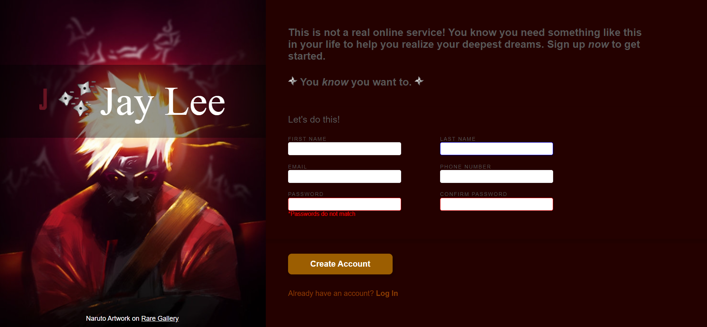

# Sign-up-Form
A simplistic sign-up form for an Odin project

This is a signup form built using HTML and CSS. It is fully responsive, meaning it can adapt to different screen sizes on different devices.

This project was created as a part of [The Odin Project](https://www.theodinproject.com/lessons/node-path-intermediate-html-and-css-sign-up-form), an open-source curriculum for learning web development.

## How to View the Sign-Up Form
To view the sign-up form, simply open the index.html file in your web browser of choice after downloading the repository.

## Features
Some of the features of this sign-up form include:

* Responsive design that works on different devices
* HTML and CSS validation to ensure code quality
* Input validation using JavaScript to prevent errors
* Clear and concise labeling to guide users through the form
